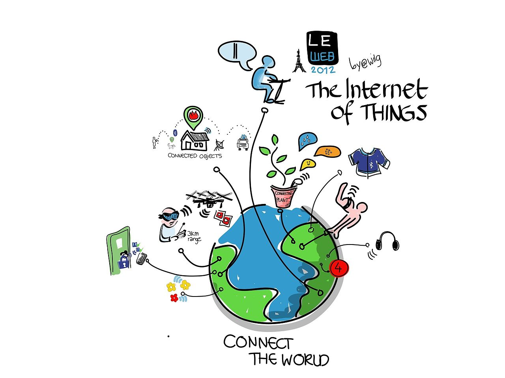

<!-- TODO: Dit hoofdstuk mag er op het einde uit -->

# Hoofdstuk titel XXX

De indeling in hoofdstukken en verdere onderverdelingen moet eenvoudig, duidelijk en consequent zijn.

Bij de indeling in hoofdstukken en verdere onderverdelingen maak je gebruik van de markdown titel en subtitel indeling. Ga hiermee niet te ver: vier niveaus diep is een absoluut maximum.

## Dit is een eerste subtitel

Elke titel / subtitel heeft een inleidende paragraaf nodig.

### Nog een niveau dieper

Dus hier dient ook een inleidende paragraaf te komen.

#### Ga niet dieper dan dit

Hier komt dan de inhoud van deze sectie.

## Externe bronnen gebruiken

Refereren en citeren laten toe om een externe bron van informatie in jouw tekst te verwerken. Dit is een heel belangrijk onderdeel van een eindwerkverhandeling omdat je zo aantoont dat jouw uitspraken en conclusies ook gebaseerd zijn op externe informatie.

*Merk hier op dat we een inleidende paragraaf geven om volgende twee sub-secties aan te duiden.*

### Refereren

Refereren is het verwijzen naar bestaande documentatie / gegevens / hypothesen maar niet letterlijk in de tekst geplaatst. Zo kan je een bewering maken en aangeven op basis van welke bron je dit doet.

Het verwijzen naar werken van andere auteurs kan op twee manieren, ofwel vermeld je de familienaam en het jaar van de publicatie tussen haakjes, ofwel vermeld je de naam van de auteur waarnaar je verwijst al in de tekst en plaats je het jaar van publicatie tussen haakjes. (De voornaam of initialen is enkel nodig indien er gerefereerd wordt aan twee auteurs met dezelfde familienaam.)

**Bijvoorbeeld:**

Omdat de tippen van de propellerbladen dan de geluidssnelheid bereiken is het niet aangewezen het toerental onbeperkt te verhogen [[Kooyman, 1995](/bibliography/README.md)].

Je kan naar een specifiek stuk uit een tekst verwijzen, door de specifieke pagina, hoofdstuk, figuur, tabel... uit de tekst toe te voegen na het jaar.

**Bijvoorbeeld:**

[[Gross, 2006, p75](/bibliography/README.md)]

### Citeren

Bij het letterlijk citeren neem je de aangehaalde tekst integraal over tussen dubbele aanhalingstekens. Dit kan je in markdown makkelijk realiseren door de tekst te prefixen met een `>` symbool. Na de aangehaalde tekst moet je de verwijzing naar de bron toevoegen.

**Bijvoorbeeld:**

> Het toerental kan echter niet onbeperkt verhoogd worden omdat de tippen van de propellerbladen dan de geluidssnelheid bereiken. [[Kooyman, 1995](/bibliography/README.md)] 

## Figuren

Figuren dienen steeds in een subdirectory van het bijhorende hoofdstuk te worden geplaatst. Deze geef je normaal de naam `img`.

Vervolgens plaats je de figuur met de correcte markdown syntax in het document.

Elke figuur die in de tekst wordt geplaatst dient ook steeds te worden toegelicht. Figuren die je niet bespreekt in de tekst worden aanzien als reclame of nutteloze bladvulling. Markdown laat niet toe om figuurnummers toe te voegen waardoor er dient verwezen te worden aan de hand van **volgende**, **onderstaande**... figuur.

**Bijvoorbeeld:**

De volgende figuur toont een schematische weergave van het Internet of Things (IoT) [[Wilgengebroed, 2012](/bibliography/README.md)]. Deze illustratie geeft duidelijk weer hoe het Internet of Things alles connecteert met elkaar.

