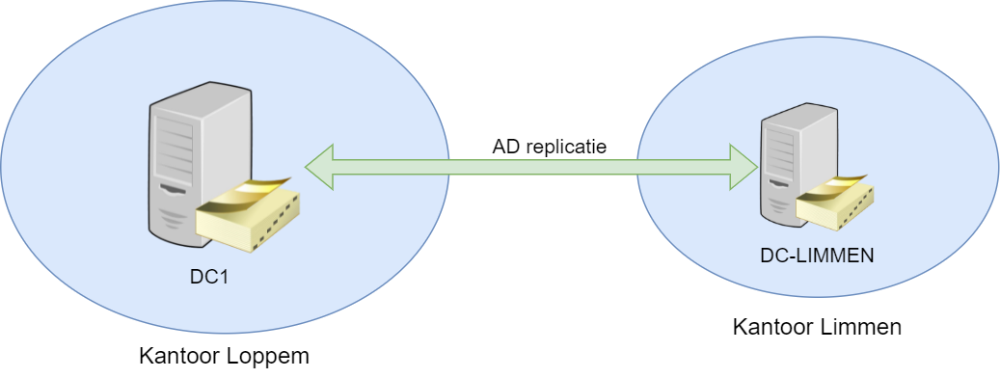
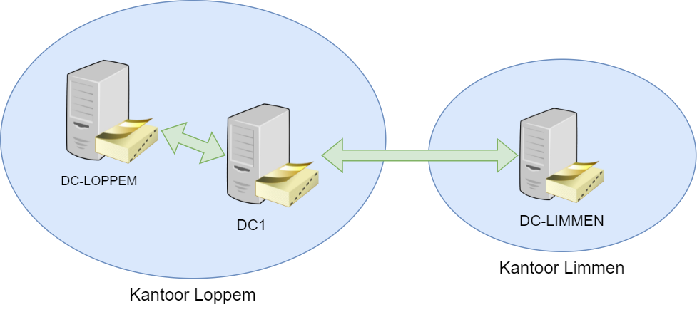
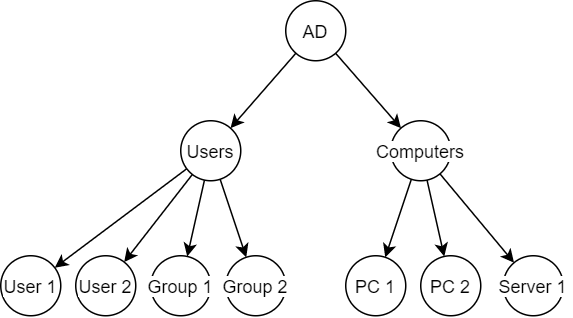
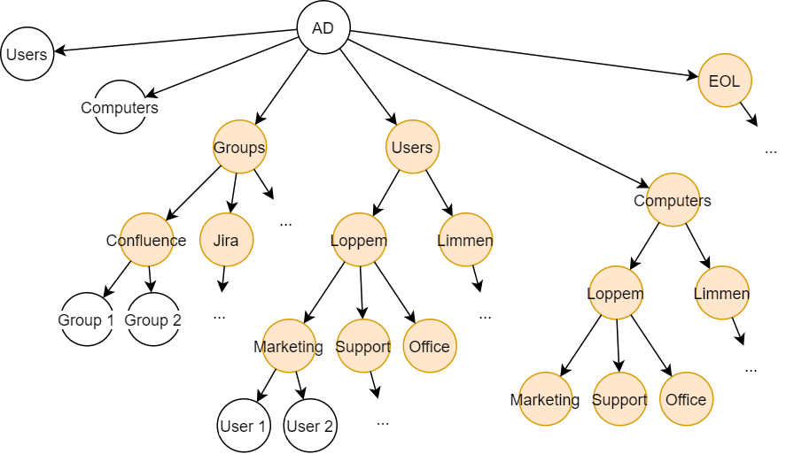
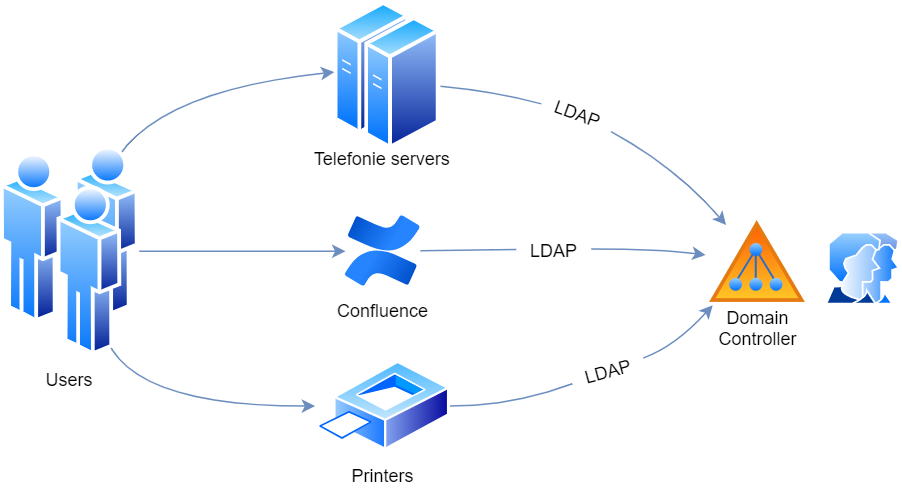

# Active Directory

Active Directory is de naam die word gegeven aan de directory service van Microsoft voor een Windows domein. Het komt inbegrepen bij meeste Windows Servers als een verzameling van services. Een Windows server die Active Directory draait staat ook gekend als een **domeincontroller**.

## Domeincontroller

De domeincontroller (dc) is een Windows Server waar alle gebruikers en computers worden in opgeslagen. Het zal de gebruikers en computers gaan authenticeren en autoriseren in een Windows domein. Bijvoorbeeld als iemand inlogt met een windows computer die lid is van het domein dan zal de domeincontroller de ingegeven gebruikersnaam hey wachtwoord controleren.

Het grootte voordeel hiervan is dat alles op 1 plek wordt opgeslagen waardoor het gemakkelijk is voor IT personeel om alles te onderhouden. Wanneer er meerdere domeincontrollers zijn dan zullen die onderling gesynchroniseerd worden zodat ze altijd in sync zijn met elkaar. Dataline heeft nu in totaal 2 domeincontrollers, één staat in Loppem en de andere staat in Limmen (Nederland).

De 2 domeincontrollers staan op 2 geografisch verschillende locaties. Een andere naam voor locatie die gebruikt wordt in context van domeincontrollers is **Site**. Hier zal er synchronisatie tussen 2 verschillende Sites gebeuren en dit wordt ook wel een **intersite verbinding** genoemd. Wanneer 2 dc's zich op dezelfde site bevinden, wordt het een **intrasite verbinding** genoemd.

### Services

Een domeincontroller staat in voor heel wat taken binnen een domein, zo zijn er een heleboel ingebouwde services waarvoor een domeincontroller kan dienen. Een paar voorbeelden hiervan zijn:
- Gebruikers en computers beheren
- Gebruikers authenticeren
- Security policies afdwingen op het domein
- DNS server
- DHCP server

### Nieuwe Domeincontroller

Een windows server versie van 2016 of later is nodig om de synchronisatie van de domeincontroller naar de cloud mogelijk te maken. Domeincontroller DC1 voldoet hier niet aan en daarom moet er een nieuwe domeincontroller geïnstalleerd worden. De domeincontroller krijgt de naam **DC-LOPPEM**. Deze domeincontroller zal in het begin samen werken met DC1 en na een bepaalde periode zal DC1 uitgeschakeld worden en neemt DC-LOPPEM de taak over. 

## OU-structuur

Een Organizational Unit (OU) is een manier om Active Directory objecten te gaan groeperen. Het wordt gebruikt om een hiërarchische structuur te creëren binnen het domein, vergemakkelijkt het beheer en kan gebruikt worden om de verschillende afdelingen en locaties voor te stellen. OU's kunnen andere OU's bevatten en Microsoft adviseert het gebruik ervan.

### Huidige structuur

De huidige structuur van Dataline werkt nog niet met OU's en er zou liefst overgestapt worden naar een duidelijke OU-structuur. Nu wordt nog een oude structuur gebruikt die er als volgt uitziet.

In bovenstaande figuur kan er worden gezien dat 2 mappen gebruikt worden, namelijk 'Users' en 'Computers'. Dit zijn 2 standaard directories die in elke domeincontroller aanwezig zijn. Users wordt gebruikt voor gebruikers en groepen terwijl computers dient voor computers en servers. Dit is een oude manier van werken waar alle objecten samen zitten en er is geen structuur zit in de indeling.

### Nieuwe structuur

De nieuwe manier van werken zal OU's gebruiken om objecten te groeperen per soort, per afdeling en per locatie. Op die manier is het gemakkelijker werken en zijn er meer mogelijkheden om gebruikers te beheren. De nieuwe structuur ziet er als volgt uit. De oranje nodes stellen OU's voor.

Er zal een OU zijn voor enkel groepen en die zal nog eens verdeeld worden onder de verschillende applicaties. Er is een OU voor gebruikers die wordt opgesplitst per locatie en dan per afdeling. Op deze manier wordt het direct duidelijk waar en op welke afdeling een gebruiker werkt. Voor de OU Computers wordt dezelfde structuur gevolgd.

De objecten die niet meer gebruikt worden komen in de groep EOL (End-of-life) terecht. Dit kan handig zijn want het gebeurt vaak dat een werknemer weg gaat en dan later terug komt.

Dit is niet de volledige structuur, maar het geeft een beeld van wat het zou moeten worden.

### Problemen

Er moet overgestapt worden naar de nieuwe structuur maar dit brengt enkele problemen met zich mee. Vele applicaties en services gebruiken nog de oude structuur en kunnen mogelijks niet meer functioneren als ze overschakelen op de nieuwe structuur. De reden hiervoor is omdat vele applicaties enkel in de Users directory zoeken naar gebruikers en groepen.

De manier waarop die applicaties gaan communiceren met de domeincontroller is aan de hand van het **LDAP protocol**.

## LDAP

LDAP of **Lightweight Directory Access Protocol** is een netwerkprotocol voor het opvragen en onderhouden van een directory service over TCP/IP. Het is een open standaard die door veel applicaties ondersteund wordt. Apps en services van Dataline gebruiken het als een interface om gegevens op te vragen van Active Directory. 

Ter illustratie worden de printers van Dataline eens bekeken. Die hebben de optie om een document in te scannen en door te mailen naar een werknemer. De printer zelf zal een LDAP query gaan uitvoeren op de domeincontroller om alle gebruikers op te halen. Die query zal er als volgt uitzien.

- **LDAP query root**: `CN=Users,DC=dataline,DC=eu`
- **LDAP query**: `(objectclass=user)(objectCategory=person)`

De **root** is de plek waar de query zal uitgevoerd worden en hier wordt dit de Users map. Dat wil zeggen dat enkel objecten gevonden worden die in de Users map zitten of in een submap ervan. De **query** zelf zal zoeken naar alle gebruikers objecten.

### Nieuwe Queries

Om de applicaties klaar te maken voor de nieuwe structuur moet bij elke applicatie de **query root** aangepast worden, zodat ook objecten niet in de Users map ontdekt kunnen worden. De **LDAP query** zelf heeft geen verandering nodig want er wordt nog steeds gezocht naar dezelfde soort objecten.

Bij de printers wordt de query dan uiteindelijk:

- **LDAP query root**: `OU=Dataline Users,DC=dataline,DC=eu`
- **LDAP query**: `(objectclass=user)(objectCategory=person)`

## Voorbeelden

Om een beter zicht te krijgen hoe LDAP queries in elkaar zitten worden nog een enkele voorbeelden gegeven die van pas kunnen komen.

#### Gebruikers zonder email

`(objectClass=user)(objectCategory=person)(!mail=*)`

Deze query zoekt naar user objecten die behoren tot de 'Person' categorie. Dit zal alle accounts terug geven die gelinkt zijn aan een persoon (geen admin of service accounts). Een user object heeft een veld 'mail' die het mail adres bevat. Met `!mail=*` worden alle gebruikers die een mail adres hebben gezocht en met het uitroepingsteken worden de selectie geïnverteerd.

#### Alle administrators accounts

`(objectClass=user)(objectCategory=person)(adminCount=1)`

Enkel administrators krijgen in het *adminCount* veld een waarde van 1.

#### Alle lege groepen oplijsten

`(objectCategory=group)(!member=*)`

Hier wordt gezocht naar alle objecten die tot de *'Group'* categorie behoren. Met `!member=*` wordt er gezocht naar de groepen die geen waarde hebben voor het member veld.

#### Alle gebruikers lid van de groep Marketing

`(objectclass=user)(MemberOf=CN=Marketing,CN=Users,DC=dataline,DC=eu)`

Hier wordt gezocht naar alle user objecten die lid zijn van een groep. Het `MemberOf` veld heeft als waarde een ander Active Directory object. Om dit te doen moet het pad ingegeven worden van dat object, in dit geval wordt dit `CN=Marketing,CN=Users,DC=dataline,DC=eu`. Deze waarde komt overeen met het een object Marketing in de Users map op het domein dataline.eu.
