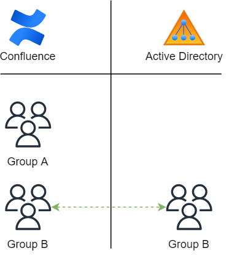
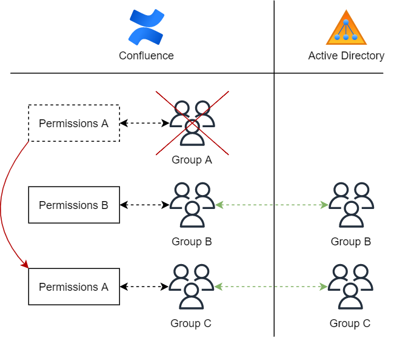
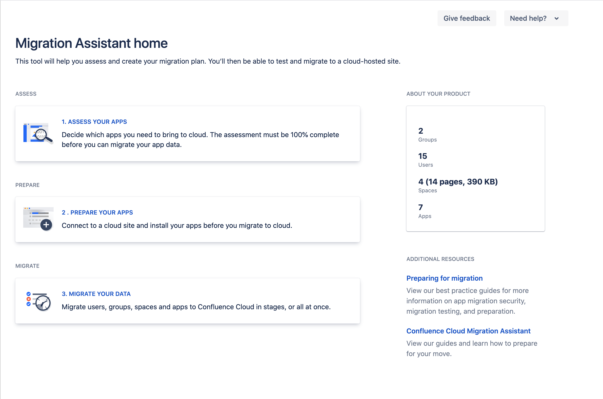
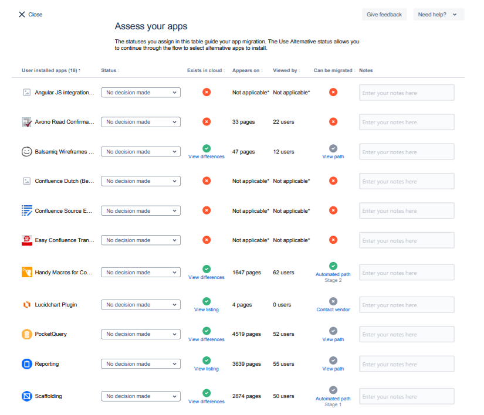

# Confluence

Confluence is een content management systeem gemaakt door Atlassian. Confluence is de centrale hub waar werknemers hun documenten kunnen delen met elkaar. Atlassian wilt afstappen van hun server producten en overstappen naar een cloud oplossing. Deze overstap moet goed gebeuren omdat Confluence een heleboel belangrijke en essentiele documenten die Dataline nodig heeft om te kunnen werken.

## Huidige omgeving

De huidige omgeving van Confluence moet klaar gemaakt worden om naar de cloud te gaan. De huidige omgeving is hier nog **niet** klaar voor. Dit geeft een paar redenen:

- Confluence groepen moeten gelinkt zijn met groepen in AD
- De huidige permissies zijn chaotisch en moeten opgekuist worden

### Groepen

Confluence heeft de optie om groepen te gaan gebruiken van in Active Directory. Nu is er een mengeling van confluence groepen en AD groepen. Er moet overgestapt worden naar enkel AD groepen. Dit is een handige feature want wanneer een werknemer lid moet worden van een groep dan kan dit op de domain controller gedaan worden en hoeft dit niet apart te gebeuren in Confluence. 

In de afbeelding hierboven is groep A is een Confluence groep terwijl groep B een Active Directory groep is.

## Permissies

Permissies kunnen toegekend worden aan **groepen** of aan **individuele gebruikers**. De Confluence omgeving van Dataline heeft nu een heleboel individuele permissies die weg moeten. De beste manier om te werken is door permissies te gaan toekennen per groep, omdat het zo eenvoudig is om permissies te geven en afnemen. Ook wanneer Confluence naar de cloud gaat dan is het nodig dat permissies alleen via groepen worden uitgedeeld.

In Confluence zijn permissies **additief**. Als iemand lid is van meerdere groepen (A, B, C, etc), dan is wat ze doen de som van de machtigingen die zijn verleend aan Groep A + Groep B + Groep C.

### Space permissies

Admins van een space dan kunnen een heleboel permissies toekennen voor die space, zoals wie wat kan zien en wat ze ermee kunnen doen. De space permissies worden toegekend aan alles in de space. 

Permissies in een space kunnen gegeven worden aan individuele gebruikers en groepen:

- **Group permissions** zijn toegepast op alle mensen die lid zijn van de groep
- **User permissions** zijn toegepast op een individuele gebruiker

### Pagina Restricties

Pagina restricties werken net iets anders dan Space permissies. Pagina's kunnen standaard gezien en bewerkt worden, maar je kan dit beperken voor bepaalde users of groepen als dat nodig is. 

Elke pagina in Confluence bevindt zich in een space, en space permissies geven de admin de mogelijkheid om de zichtbaarheid van alles in de space te beheren. Zelf de mogelijkheid om permissies aan te passen van een pagina's wordt gecontroleerd door de *restrict pages* space permissie.

### AD groepen

Het doel is om alle groepen in Confluence Active Directory groepen te maken. Nu zijn er nog een aantal groepen die enkel in Confluence zitten en die groepen hebben bijhorende permissies. Het is niet mogelijk om een nieuwe AD groep te linken met een bestaande Confluence groep. Daarom moeten de permissies van de Confluence groep overgezet worden naar een nieuwe AD groep.

De permissies van groep A worden overgezet naar de Active directory groep C. De groep A wordt dan verwijdert vanuit Confluence. Het overzetten van de permissies moet gebeuren aan de hand van een SQL query omdat Atlassian deze functionaliteit nog niet geïmplementeerd heeft.

## Confluence Producten

Confluence stopt support voor de standaard server producten. Dat is de versie die Dataline nu voorlopig nog gebruikt. De support hiervoor stopt in 2024. Er zijn in totaal 3 producten van Confluence. 

- Server editie
- Datacenter editie
- Cloud editie

De server editie stopt in 2024 en Atlassian verplicht mensen om over te stappen naar de Datacenter of Cloud editie. De cloud editie meerdere programma's om tussen te kiezen:

| | Free | Standard | Premium | Enterprise |
| :--- | :---: | :---: | :---: | :---: |
| Prijs per user | 0 | $5,50 | $10,50 | Jaarlijkse Factuur |
| Prijs per maand (50 users) | 0 | $275 | $525 | Jaarlijkse Factuur |
| Max aantal gebruikers | 10 | 20.000 | 20.000 | 20.000 |
| Storage | 2 GB | 250 GB | unlimited | unlimited |

Dan hebben is er ook nog de Datacenter versie die $27.000 kost per jaar. Daarin zit alle functionaliteit en kan er nog lokaal on-premise gewerkt worden. Atlassian zegt zelf het volgende

> Met onze Data Center-producten kun je profiteren van de flexibiliteit om te implementeren op een infrastructuur naar keuze. Dit is de beste keuze voor degenen met unieke of complexe operationele vereisten of die verder willen opschalen dan onze huidige cloudgebruikersniveaus. Als je upgradet heb je volledige controle over gegevensbeheer, beveiliging en compliance, en over hoe je uptime en prestaties beheert. **We raden Data Center aan voor degenen die strengere vereisten hebben en nog niet kunnen overstappen naar cloud**.

Mijn eerste indruk is dat de Datacenter editie niet voor ons zal zijn aangezien het duur is en enkel nodig is als je de vereisten niet hebt om naar de cloud over te stappen. De logische keuze lijkt te gaan naar de standard cloud editie, aangezien die goedkoop is en juist genoeg storage zal hebben. Onze huidige confluence server heeft namelijk 256 GB aan storage.

[Hier](https://www.atlassian.com/nl/migration/assess/compare-cloud-data-center) kan worden alle verschillen tussen de cloud versie en de datacenter versie nog eens opgelijst.

## Overstap naar de cloud

Migreren gebeurt met de Confluence Cloud migration Assistant. Dit is een applicatie die het gemakkelijk maakt om de data, gebruiker en groepen van Confluence te brengen naar de Cloud. Voor Jira is er een andere applicatie beschikbaar namelijk de Jira Cloud Migration Assistant. Die werkt gelijkaardig als de Confluence migration assistant.

### Assess your apps

In onderstaande afbeelding staan alle applicaties (plugins) die geïnstalleerd zijn op Confluence. Per applicatie staat er dan of de app kan gemigreerd worden en indien dit mogelijk is het pad die moet gevolgd worden. Er zijn een heleboel applicaties die amper gebruikt worden en die waarschijnlijk gewoon weg mogen. De belangrijkste applicaties zullen de volgende zijn: Handy Macro's, PocketQuery, Reporting en Scaffolding.

Merk op dat er bij 'can be migrated` verschillende mogelijkheden zijn gebaseerd op hoe vlot het migratie process zal gebeuren.

| | Beschrijving |
| :-----: | :--- |
| :x: | Applicatie kan niet gemigreerd worden aangezien er geen alternatief is voor in de Cloud. |
| :heavy_check_mark: | Applicatie kan gemigreerd worden naar de cloud maar niet volledig automatisch. Er zijn nog bepaalde dingen waar rekening moet mee gehouden. |
| :heavy_check_mark: stage 1 | Applicatie in stage 1 hebben een ongekende of lage migratie success rate. Met andere woorden er is een grote kans dat het fout loopt. Bij problemen moet er contact opgenomen worden met de app vendor. |
| :heavy_check_mark: stage 2 | Applicaties in stage 2 hebben een hoge success rate voor migratie naar de cloud. |

::: danger BELANGRIJK!
Er zijn een aantal Queries van **PocketQuery** die niet ondersteund worden in de cloud! Die plugin is nodig om data van externe systemen op te lijsten in confluence. PocketQuery wordt nu door 4519 pagina's in Confluence gebruikt. Het kan gemigreerd worden naar de Cloud maar wel niet automatisch. Er zijn nog enkele queries die gebruikt worden die niet zullen werken in de cloud. Daarom moet er nog even gewacht worden met de migratie totdat de queries vervangen zijn door functionele cloud alternatieven.
:::

## Automatic User/Group Provisioning

Automatic User/Group provisioning is het process die automatisch gebruikers en groepen gaat aanmaken, verwijderen en up to date houden. Nu haalt Confluence de gebruikers en groepen van de lokale domain controller, maar als er verhuist wordt naar de cloud hoe zal dit dan gebeuren? Atlassian geeft ons de mogelijkheid om dit via **Azure AD**, maar er moeten wel aan een aantal prerequisites voldaan zijn.

### Voorwaarden

Om de automatic user/group provisioning te activeren zijn er enkele voorwaarden:
- An Azure AD tenant
- A user account in Azure AD with permission to configure provisioning
- An Atlassian Cloud tenant with an **Atlassian Access subscription**
- A user account in Atlassian Cloud with Admin permissions

Om automatic user provisioning te gaan implementeren is er een abonnement nodig is voor **Atlassian Access**. Atlassian Access is een apart programma die extra kost bovenop de confluence cloud subscriptie. Hieronder kan je de prijzen zien van de verschillende abonnementen:

| Prijs per user | 100 users | 500 users | 1000 users |
| :--- | :---: | :---: | :---: |
| Confluence | $5,50 | $5,50 | $5,50 |
| Confluence + Access | $9,50 | $7,44 | $6,79 |

## Jira

Een ander product van Atlassian is Jira. Dit wordt ook gebruikt in Dataline en het is een issue tracking programma die bugs tracked en zorgen voor agile project management. De producten die Atlassian heeft van Jira zijn de volgende:

- Jira Cloud
- Jira Server
- Jira Datacenter

Gelijkaardig met Confluence stopt de support voor de server versie in 2024. De cloud editie is de logische keuze aangezien de Datacenter edition zeer duur is en gericht is op grote bedrijven die nog niet klaar zijn om naar de cloud over te stappen. De cloud editie komt in volgende versies:

| | Free | Standard | Premium | Enterprise |
| :--- | :---: | :---: | :---: | :---: |
| Prijs per user | 0 | $7,50 | $14,50 | Jaarlijkse Factuur |
| Prijs per maand (50 users) | 0 | $375 | $725 | Jaarlijkse Factuur |
| Max aantal gebruikers | 10 | 20.000 | 20.000 | 20.000 |
| Storage | 2 GB | 250 GB | unlimited | unlimited |

Voor ons is de standard versie de beste keuze aangezien deze het goedkoopst is en er genoeg features in zitten