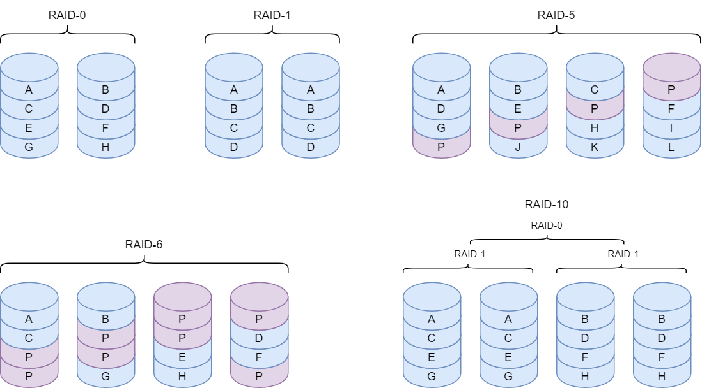
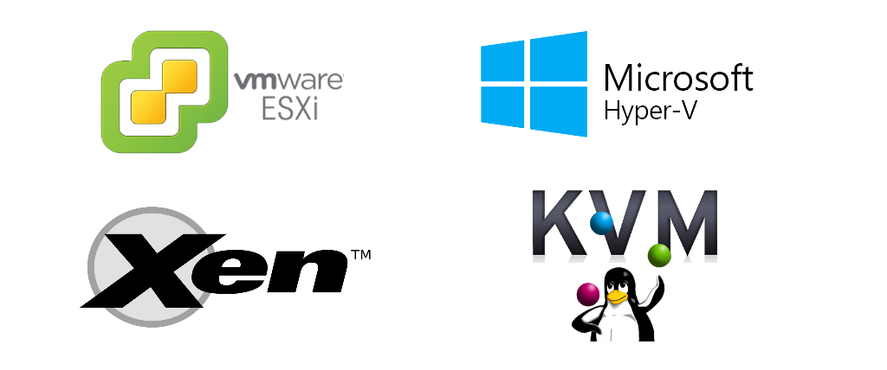
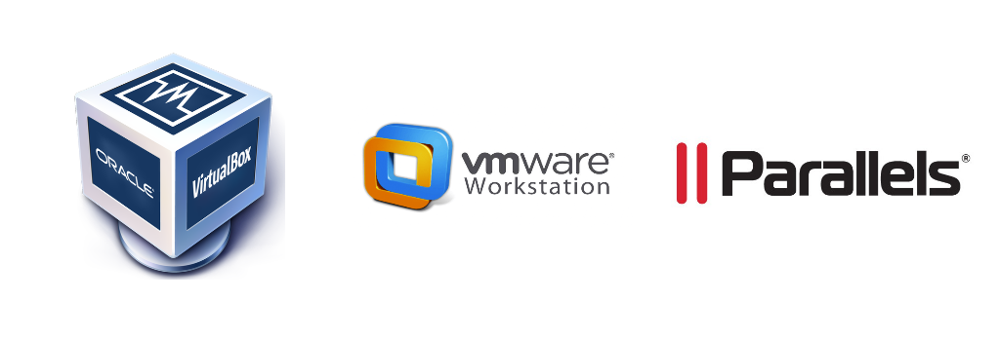

# Data Storage

Het beheren van data is zeer belangrijk voor elk bedrijf, data verlies kan leiden tot serieuze gevolgen en hoge kosten. Daarom moet het absoluut vermeden worden. Een goed beheer van data is nodig om de IT-infrastructuur in goede banen te leiden.

Methoden zoals RAID en backups worden gebruikt om data te gaan beveiligen, maar deze hebben ook hun nadelen. Zoals bijvoorbeeld de hersteltijd van RAID setups of het feit dat backups maken lastig kan zijn. Dit wordt later in dit hoofdstuk nog besproken.

Wanneer er gesproken wordt over data storage dan mogen virtuele machines niet vergeten worden. Dataline maakt gebruik van virtuele machines om verschillende applicaties en services uit te voeren. De data van de virtuele machines moet beschermd worden zodat de applicaties altijd up and running zijn.

## RAID

RAID of redundant array of independent disks wordt gebruikt om harde schijven te gaan combineren in 1 enkel volume. Het doel ervan is om reads-/writes te versnellen of om data te beschermen. Dataline gebruikt RAID om data van hun servers te gaan beschermen en versnellen. 

### RAID Types

#### RAID 0

Deze manier wordt ook **striping** genoemd en dient om storage te gaan versnellen. De data wordt verspreid over 2 harde schijven en dit zorgt ervoor dat je data tegelijk van beide schijven kan ophalen. Merk op dat deze aanpak de kans op data verlies juist zal vergroten, aangezien er slechts 1 schijf moet falen om de data te verliezen. Deze methode wordt daarom enkel gebruikt voor niet belangrijke data die versnelt moet worden.

#### RAID 1

Deze manier wordt ook **mirroring** genoemd. Er wordt een kopie opgeslagen van de data op 2 verschillende harde schijven. Dit zorgt ervoor als een enkel schijf faalt je nog steeds een kopie hebt van je data. Wanneer beide schijven falen zal je wel data verlies hebben.

#### RAID 5

Met RAID-5 zal de data verspreid worden over 3 of meer opslag apparaten. Naast de data worden ook pariteitsblokken opgeslagen. Deze pariteitsblokken zorgen dat wanneer er iets misloopt je de data kan herstellen. Deze aanpak neemt minder plek in dan RAID-1 maar geeft dezelfde bescherming. Aangezien de data zal verspreid worden over meerdere harde schijven zal data inlezen sneller gebeuren. 

Een nadeel van RAID-5 is dat data schrijven traag zal zijn, omdat ook telkens de pariteit moet berekend worden.

#### RAID 6

Met RAID-6 wordt de data verspreid over 4 of meer opslag apparaten. Deze methode werkt op dezelfde manier als RAID-5 maar je zal 2 pariteitsblokken opslaan. Dit zorgt dat RAID-6 twee schijven kan verliezen. Aan de andere kant maakt dit het schrijven van data nog trager dan RAID-5 omdat nu 2 pariteitsblokken moeten berekent worden.

#### RAID 10

Deze methode combineert de voordelen van RAID-1 en RAID-0. Striping en mirroring wordt toegepast op de data. Hiervoor zijn er minstens 4 opslag apparaten nodig.

### Software- vs Hardware RAID

Er zijn 2 manieren om RAID te gaan implementeren in Software of met hardware. Bij Hardware RAID zal er een extra fysieke component nodig zijn in de computer. Deze component wordt ook de **RAID controller** genoemd. Bij software is er geen controller nodig en zal het operating system (OS) RAID implementeren. 

Hier worden de voor- en nadelen van beide methoden eens bekeken.

| Software RAID | Hardware RAID |
| :---: | :---: |
| Komt samen met OS (goedkoper) | Heeft een RAID controller nodig (duurder) |
| Zet een last op CPU (trager) | Werkt onafhankelijk van de CPU (sneller) |
| Schijven zijn niet hot swappable | Schijven zijn wel hot swappable |

Hot swappable wil zeggen dat schijven kunnen verwisselt worden zonder het systeem af te sluiten.

### Failures To Tolerate

Een belangrijk aspect van elke RAID configuratie is hoeveel opslagplek ze innemen en hoeveel fouten ze kunnen tolereren. Het aantal schijven dat een RAID configuratie kan verliezen noemt men in het Engels ook **failures to tolerate** (FTT).

Hieronder worden de FTT, de gegevensgrootte en de benodigde capaciteit vergeleken van de verschillende RAID configuraties.

| RAID configuratie | FTT | Gegevensgrootte | Benodigde capaciteit  |
| :--- | :---: | :---: | :---: |
| RAID 0 | 0 | 100 GB | 100 GB |
| RAID 1 | 1 | 100 GB | 200 GB |
| RAID 1 | 2 | 100 GB | 300 GB |
| RAID 5 | 1 | 100 GB | 133 GB |
| RAID 6 | 2 | 100 GB | 150 GB |
| RAID 10 | 1 (soms 2)* | 100 GB | 200 GB |

*\* Wanneer er 2 fouten gebeuren in hetzelfde RAID 1 paar heb je wel data verlies.*

## Virtuele Machines

Bij het gebruikt van virtuele machines komt er ook storage kijken. Het beheren van je de data van virtuele machines kan een moeilijk process zijn en is enorm belangrijk om ervoor te zorgen dat je VM's altijd up and running zijn. Het programma die virtuele machines beheert op een server is gekend als een **Hypervisor**.

Een **Hypervisor** dient om meerdere besturingssystemen tegelijk op een computer te laten draaien. Hyper visors zijn opgedeeld in 2 types. Type 1 (Native) en Type 2 (Hosted).

### Type 1

Een type 1 hypervisor draait rechtstreeks op de computer hardware en daarom word deze ook **Bare Metal** genoemd. Er is geen tussenkomst van het Besturingssysteem van de host. Dit wil zeggen dat Type 1 hypervisors efficiënt zijn om resources te gaan uitdelen aan de virtuele machines.

Enkele voorbeelden van type 1 hypervisors zijn: **VMware ESXi, Citrix Xen, KMV en Microsoft Hyper-V**.

### Type 2

Een type 2 hypervisor zal niet rechtstreeks werken op de computer hardware. Er zit nog een Besturingssysteem tussen. Een voordeel van een type 2 hypervisor is dat het gemakkelijk te gebruiken is omdat het kan geïnstalleerd worden als een programma. Het nadeel hiervan is dat het minder efficiënt is aangezien er nog een besturingssysteem tussen zit. 

Voorbeelden van type 2 hypervisors zijn: **Oracle VirtualBox, VMware Workstation, Parallels Desktop**.

Dataline maakt gebruikt van 2 verschillende hypervisors om hun virtuele machines te laten draaien. Ze maken gebruik van KVM en ESXi, beide type 1 hypervisors. KVM is een gratis open source linux gebaseerde hypervisor terwijl ESXi een licentie nodig heeft om beschikking te hebben over de volledige functionaliteit. 

ESXi wordt enkel gebruikt voor de telefonie servers. De reden hiervoor is omdat het bedrijf die de telefonie servers aanbied enkel werkt met VMWare ESXi. Dataline gebruikt een gratis licentie die beperkte functionaliteit heeft. Aangezien enkel de telefonie servers moeten werken met ESXi is een gratis licentie voldoende.

### Storage van Virtuele Machines

<!-- Om beter te begrijpen hoe virtuele machines gebruik maken van storage moet er eerst gekeken worden naar de bestanden die worden aangemaakt om een virtuele machine voor te stellen. Elk bestand heeft een specifieke functie en wordt gebruikt om alles te gaan virtualiseren. Elke hypervisor heeft zijn eigen indeling voor deze bestanden.

De focus wordt hier gelegd op de indeling van ESXi aangezien de telefonie servers zeer belangrijk zijn. Werknemers maken gebruik van de telefonie servers om contact op te leggen met de klanten. Als deze servers niet beschikbaar zijn dan kunnen de werknemers hun job niet doen. Andere services zoals de backup server of de file server worden minder frequent gebruikt. 

ESXi gebruikt een heleboel bestanden om Virtuele machine te gaan voorstellen. In onderstaande tabel worden de verschillende bestanden opgelijst.

| Bestand | Beschrijving |
| :---: | :--- |
| VMX | configuratie file gebruikt door vmware |
| NVRAM | deze file bevat alle BIOS settings van de virtuele machine |
| VMDK | een container file voor virtuele harde schijven die alle data bevat  |
| Logs | alle logs worden hier in opgeslagen |
| Swap | File gebruikt om swap geheugen te implementeren |
| Delta | bevat de verschillen van de huidige status van de VM t.o.v. een snapshot |
| Mem | Een snapshot van de memory van de computer | -->
<!-- 
Om een backup te maken van een virtuele machine worden deze bestanden gekopieerd naar de backup server. -->

Een probleem dat Dataline nu nog heeft op het vlak van storage is met de telefonie servers. Deze draaien allemaal op virtuele machines. Elke virtuele machine bestaat uit een aantal bestanden die de status van de machine voorstelt. Als beveiliging worden er back ups genomen van die bestanden. Deze aanpak heeft echter enkele nadelen:

- Er is een single point of failure in de telefonie servers. Als 1 iets kapot gaat kunnen mensen niet meer telefoneren.
- Back ups nemen is lastig
- Er zijn maar een paar mensen die weten hoe een virtuele machine herstelt kan worden van een back up.

Er moet een manier zijn om de bestanden van de VM te beveiligen tegen wanneer er iets misloopt. Dit moet een process zijn dat automatisch gebeurt.

<!-- ## Probleem met backups

Er zijn enkele problemen met de huidige manier van werken op vlak van backups. Het probleem ligt bij de telefonie servers, de huidige manier van werken is lastig en niet efficient.

### Probleem 1

Om een virtuele machine te gaan herstellen van een backup is er heel wat kennis nodig en er zijn niet veel mensen die weten hoe dit moet. Wanneer er niemand op de werkvloer is met genoeg kennis dan zal de service of applicatie down blijven. Er moet een manier zijn om automatisch of gemakkelijk de virtuele machine terug draaiende te krijgen.

### Probleem 2

Het nemen van backups van de telefonie servers is zeer lastig omdat er telkens een backup genomen moet worden van de volledige harde schijf. Dit zorgt dat incrementele backups enorm veel plaats innemen waardoor dit niet echt een optie is. De reden dat telkens de volledige schijf moet gekopieerd worden is omdat de gratis versie van ESXi niet alle functionaliteit bevat. Dit zou wel mogelijk zijn met een betalende versie. -->

### SAN

Een SAN is een storage area network. Het is een apart netwerk speciaal gemaakt om de storage op een centrale plek op te kunnen slaan. Servers communiceren dan via dit netwerk om gebruik te maken van storage.

Dit is de ideale oplossing om de virtuele machines bestendig te maken tegen fouten. De reden hiervoor is omdat in een SAN data 2 maal kunnen opslaan. Wanneer er iets misloopt met de storage is er altijd nog een kopie van de data. Dit process kan automatisch gebeuren en er hoeft niemand manueel tussen te komen.

Deze oplossing wordt verder uitgediept in het volgende hoofdstuk.