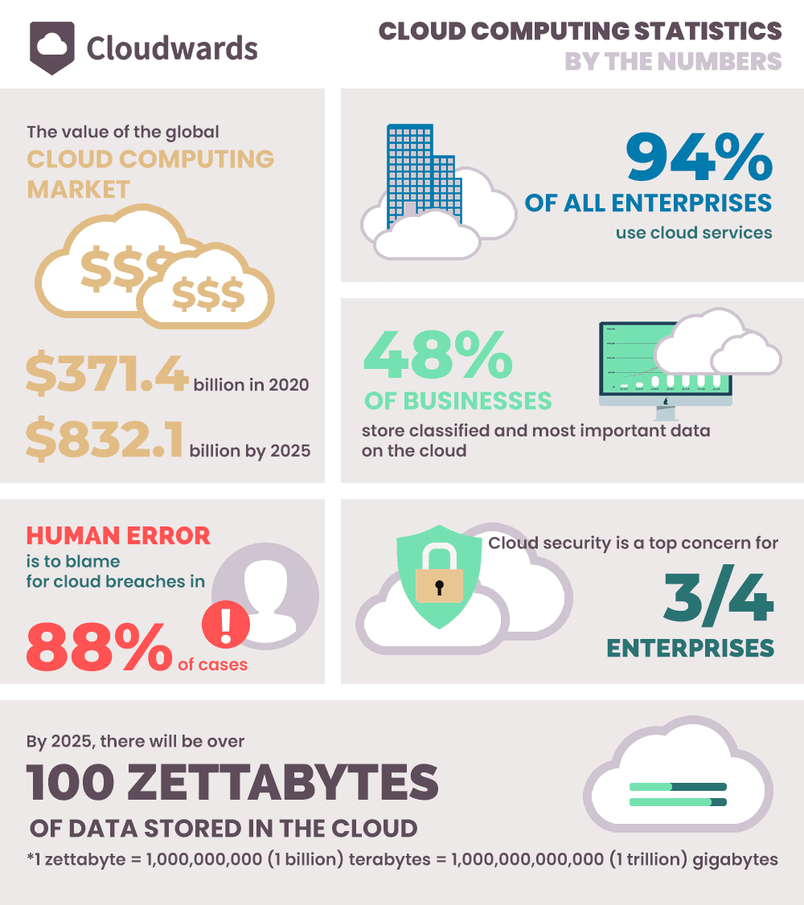
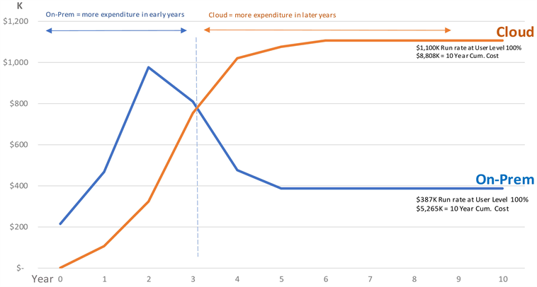
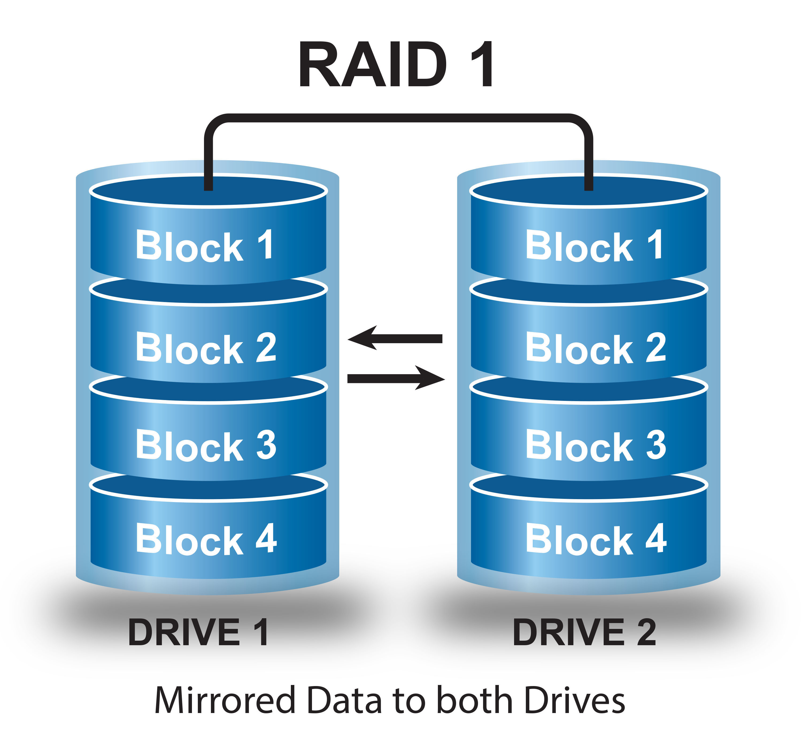
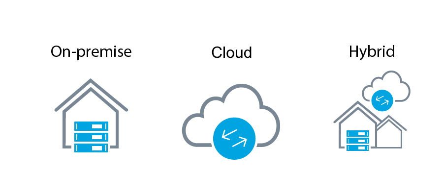

# Introductie

Heel wat bedrijven gebruiken nog lokale servers om hun applicaties en data op te slaan. Dit geeft hen veel controle over wat er gebeurt met hun IT omgeving, maar heeft ook zijn nadelen. Zoals het feit dat het bedrijf een team moet samen stellen om dit op te onderhouden. Ook kan het zeer kostelijk zijn om uit te breiden en nieuwe apparatuur aan te kopen. Een alternatief hiervoor is **Cloud computing** en het wordt steeds populairder. [Sumina, 2022](https://www.cloudwards.net/cloud-computing-statistics/).

Een groot voordeel van Cloud computing is dat het zeer flexibel is. Werken in de cloud is veel simpeler om de omgeving up-to-date te houden en te gaan uitbreiden. Stel dat er nood is aan extra bandbreedte of storage, dan kan de cloud direct aan die vraag voldoen, in plaats van een complexe (en dure) update van de IT-infrastructuur te ondergaan.

Aan de andere kant kan cloud computing duur zijn, elke maand moet er een som betaalt worden en na een lange periode lopen die kosten op. Wanneer er lokaal gewerkt is dit niet, daarom dat lokaal werken op lange termijn goedkoper is. Het is dus zeer belangrijk om te kijken welke applicaties mogen blijven en welke beter naar de cloud vertrekken. In grafiek is er een vergelijking van de kost tussen de 2 te zien. [Fisher, 2018](https://www.scirp.org/html/7-2121263_87661.htm)

Een ander belangrijk aspect is fouttolerantie. Het kan altijd gebeuren dat een applicatie of service plots niet meer werkt. In dat geval moet er een alternatief zijn om snel de services terug up and running te krijgen. 
Er moet dus vermeden worden dat er een **Single Point Of Failure** bestaat. Zodat wanneer één iets kapot gaat er direct een alternatief is die de taak kan overnemen. Een manier om applicaties en data fouttolerant te maken zou kunnen zijn om alles meerdere malen te gaan opslaan. Dit noemt men in het Engels ook **Redundancy** (overbodigheid).

Bijvoorbeeld met een RAID configuratie kan data worden gedupliceerd over meerdere harde schijven. Dit zorgt dat de er altijd een kopie wordt gemaakt.

Er zijn 3 opties waartussen een bedrijf kan kiezen om hun applicaties en data op te slaan. 

- On Premise
- De Cloud
- Een hybride oplossing

Elke van deze opties heeft zijn voor- en nadelen. Wat is nu de beste oplossing qua prijs, gebruikersgemak en beveiliging? Dat is wat ik zal proberen te beantwoorden in deze analyse.

### On premise

Alle data en applicaties worden opgeslagen op lokale servers in het bedrijf. Meestal wordt dit afgesloten van de buitenwereld en zijn de toepassingen enkel beschikbaar op de werkvloer. Dit is gemakkelijk omdat alles heel dichtbij staat en je veel vrijheid hebt wat je doet met de servers.

### De Cloud

De cloud of cloud computing is een dienst die aangeboden wordt door een bedrijf om software of hardware ter beschikking te stellen over het internet. De cloud provider zorgt voor het onderhoud en kosten van de fysieke apparatuur zoals de fysieke apparatuur zoals de servers. Gebaseerd op de noden van je bedrijf kun je dan een aantal servers huren.

### Hybride Oplossing

Met een hybride oplossing wordt er gedeeltelijk in de cloud gewerkt en ook on premise. Het kan soms zijn dat er een applicatie draait in de cloud maar verbonden is met een server on premise.

## Dataline Solutions nv

Dataline is een bedrijf dat actief is in de print industrie en een ontwikkelaar van software. Multipress is één van hun applicaties, het digitaliseert het volledige process van drukkerijen. Van het eerste contact met de klant tot het controleren van de magazijn, en zelf de facturen opmaken. Dataline focust ook op het helpen van de klanten en probeert zich steeds uit te breiden. Multipress is de meest populaire MIS/ERP software voor de print industrie in heel Europa.

Dataline zelf heeft in hun hoofdkantoor in Loppem een hele IT infrastructuur. Daarbij horen een heleboel applicaties die gebruikt worden door de werknemers. Sommige applicaties die worden niet meer ondersteund en moeten naar de cloud. Daarom moet er onderzocht worden welke applicatie's best naar de cloud verplaatsen en welke best nog on premise blijven.

Dit is zeer belangrijk voor Dataline voor de toekomst en de kostprijs van de IT infrastructuur. Hoe moet hun infrastructuur veranderen om up-to-date te blijven. Cloud computing kan ook de kostprijs verlagen en gebruikersgemak verhogen.

## Doelstelling

Dit is een complex probleem waar een analyse gemaakt moet worden van de huidige IT omgeving, kijken hoe die kan worden verbeterd en een plan opstellen voor de toekomst.

In de eerste fase bekijken worden de verschillende applicaties die Dataline heeft bekeken. Alle servers worden opgelijst die in de huidige omgeving gebruikt worden. Specificaties van de servers worden bekeken zoals het aantal CPU's, de hoeveelheid RAM en de hoeveelheid storage. Uit deze lijst wordt er gekeken welke applicaties naar de cloud moeten en welke die beter on premise zouden blijven.

In de tweede fase wordt er onderzoek gedaan naar elke applicatie en er wordt gekeken naar de mogelijkheid om naar de cloud te gaan. Verschillende cloud providers worden bekeken en er wordt een onderzoek gedaan op wat de beste mogelijkheid is qua prijs efficiëntie. Ook wordt er gekeken naar het migratie process naar de cloud. Hoe moet de data naar de cloud gebracht worden en kunnen er problemen optreden.

In de derde fase wordt er gekeken naar de applicaties die lokaal moeten blijven. Voor die applicaties moet er ook gekeken worden naar de storage ervan zodat die applicaties fout tolerant zijn. Er zijn hier vele mogelijke aanpakken voor, welke is geschikt voor Dataline en past in hun budget?

Ten slotte word een test opstelling gemaakt op vlak van storage. Dit om te kijken of deze storage optie wel goed is voor de prijs.