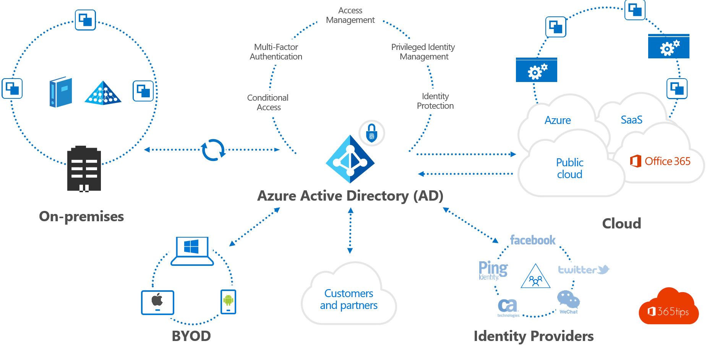
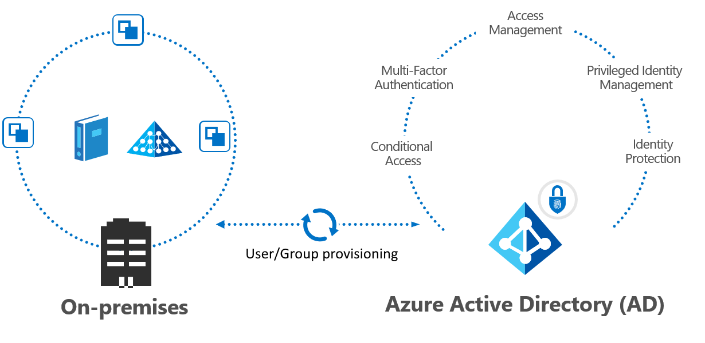

# Microsoft Azure

Dataline zelf heeft al een Office 365. Dat is een online cloud omgeving die allerlei services zal aanbieden. Het word gebruikt om bijvoorbeeld Office licenties voor word, excel en powerpoint toe te kennen aan gebruikers. Deze gebruikers worden opgeslagen in een Azure AD omgeving.

Met de huidige implemtatie hebben gebruikers dan 2 accounts:
- **Een Azure AD account in de cloud**
- **Een on premise Active Directory account**

Deze 2 accounts hebben aparte wachtwoorden en dit kan lastig zijn voor gebruikers. Om de huidige omgeving te brengen naar de cloud moeten deze accounts gesynchroniseerd worden. Eenmaal ze gesynchroniseerd zijn dan kunnen de accounts in Azure AD gaan gebruikt worden om de gebruikers te authenticeren in de cloud. Deze accounts kunnen dan worden geïntegreerd met andere cloud applicaties.

## Azure AD

Azure Active Directory (Azure AD) is een identiteits- en toegangsbeheerservice in de cloud. Het helpt om werknemers toegang te geven tot externe resources zoals Office 365 en andere cloud toepassingen.

Zoals je kan zien in de figuur dient Azure AD als een centrale plek die dient om de gebruiker accounts overal te verspreiden. Wat wij moeten gaan realiseren is de pijl tussen de **on-premises** en **Azure AD**.
Microsoft geeft ons een heleboel manieren om dit probleem aan te pakken. Hier worden de opties overlopen om tot de juiste conclusie te komen.

### Bepalen van Hybrid Identity

Om gebruikers te gaan identificeren is een oplossing nodig die werkt on premise maar ook in de cloud. Microsoft noemt zo'n oplossing een **Hybrid Identity**. Het zorgt dat gebruikers zich kunnen gaan authenticeren en autoriseren zowel in de cloud als on premise. Er zijn 3 verschillende methoden om een hybrid identity te gaan implementeren:

- Password hash sync
- Pass-through authentication
- Federation

#### Password hash synchronization

De hash waarde van het wachtwoord in Active Directory zal gesynchroniseerd worden met een hash die word opgeslagen in de cloud. Zo kunnen gebruikers inloggen in de cloud met hetzelfde wachtwoord. Dit is de standaard methode om authenticatie te gaan doen en het is ook de gemakkelijkste manier.

Password hash sync heeft ook een optie **Leaked credential detection**. Microsoft werkt samen met dark web onderzoekers en law enforcement agencies om gelekte credentials te vinden. Als Microsoft merkt dat er wachtwoorden van jouw organisatie tussen zitten dan wordt er een melding gegeven.

#### Pass-through authentication

Met Pass-through authentication gebeurt de authenticatie niet meer in de cloud maar on premise. Wanneer een gebruiker probeert in te loggen via de cloud wordt er een verbinding gemaakt met de Active Directory die lokaal op het kantoor staat.

Een voordeel hiervan t.o.v. password hash sync is dat alle authenticatie nu gebeurt op de lokale domain controller. Dit zorgt dat lokale security en password policies toegepast kunnen worden zelf als de gebruiker inlogt via de cloud. 

#### Federation

Deze aanpak gebruikt een aparte vertrouwde server om de authenticatie te gaan doen. Mensen die van buiten af toegang willen tot de cloud moeten zich eerst authenticeren bij die server. Mensen die lokaal proberen in te loggen kunnen gewoon gebruik maken van de on premise active directory.

Het grote voordeel van Federation is dat er enorm veel vrijheid is om de authenticatie te gaan doen. De andere 2 methoden zijn standaard methoden van microsoft die beperkte functionaliteit hebben. Zo kun je bijvoorbeeld met federation smartcard authenticatie implementeren wat niet mogelijk is met de andere methoden.

## Hybrid Identity Keuze

Om ons te helpen met de juiste keuze te maken heeft Microsoft een flowchart opgesteld.

Microsoft geeft ons 5 mogelijke oplossingen om mee te werken. 

- Password Hash Sync
- Pass-through Auth 
- Pass-through Auth + Password Hash Sync
- Federation
- Federation + Password Hash Sync

Password hash Sync kan gecombineerd worden met de andere authenticatie methoden. Zo kan de **Leaked Credentials Detection** van password hash sync combineren met Pass-through authentication en Federation. 
De combinatie met Password hash sync heeft nog een voordeel en dat is dat het kan gebruikt worden als backup methode voor moest er iets mislopen. Dit wordt ook **Sign in disaster recovery** genoemd.

#### Keuze

Federation zal zeker geen optie zijn voor Dataline. Het is lastig om op te zetten en is overbodig, een andere methode zou beter passen. De Leaked credentials report zou een feature zijn die van pas zou kunnen komen. Daarom dat onze keuze zeker Password Hash Sync moeten bevatten.

Dat geeft ons nog 2 keuzes:

- **Password Hash Sync**
- **Pass-through Auth + Password Hash Sync**

Pass-through Auth + Password Hash Sync zo ideaal zijn maar het laat ons niet toe om de Cloud Sync Agent te gebruiken. Dit is iets wat later nog aan bod komt maar daarom gaat onze keuze naar **Password Hash Sync**.

## User en group provisioning

Dataline wil de Active Directory synchroniseren met Azure AD. Dit noemt provisioning en het is een process die automatisch gebruikers gaat aanmaken, verwijderen en up to date houden.

Er zijn 2 opties om automatic user en groep provisioning te gaan doen.

### Azure AD connect sync

Veel agent heeft goede support en is robust, zeker een mogelijke optie. Kan moeilijk zijn om te configureren en kostelijk om te onderhouden. Heeft ook een grote investering nodig op vlak van infrastructuur (sterke server nodig voor synchronisatie).

### Azure AD connect cloud sync

Nieuwste optie support, zeer snel en makkelijk op te zetten. Hoge availability. Is lightweight dus geen nood aan een sterke server voor de synchronisatie.

### Besluit

Er is niet echt een goede server om de Connect Sync server te runnen en de extra features van Connect Sync zijn niet echt nodig. De belangrijkste feature was password writeback en deze word ondersteunt door beide. Daarom gaat de voorkeur naar de Cloud Sync methode. Een volledige lijst met alle verschillen tussen de 2 kun je vinden in de Microsoft Docs [hier](https://docs.microsoft.com/en-us/azure/active-directory/cloud-sync/what-is-cloud-sync#comparison-between-azure-ad-connect-and-cloud-sync)

## Soft- en Hardmatch

Om de bestaande account van Office 365 te synchroniseren met de Active Directory account moet er een manier zijn om deze gesynchroniseerd te krijgen met elkaar. Maar hoe weet de synchronisatie agent welke accounts overeen komen met elkaar? Dit gebeurt aan de hand van een **Soft- of Hardmatch**.

De Office 365 accounts zijn belangrijk omdat die gebruikt worden om licenties aan gebruikers toe te kennen (bv Word). Als er iets misloopt bij het matchen van de 2 accounts zal er een nieuw account aangemaakt worden. Dat zorgt ervoor dat de licentie niet zal toegekend zijn voor die persoon. Het is dus belangrijk dat dit goed verloopt.

### Softmatch

Bij een soft match gaat er gekeken worden naar 2 attributen van een gebruiker. 

- **proxyAddresses**
- **userPrincipalName** 

Het attribuut **proxyAddresses** bestaat uit meerdere delen. Hier zal er enkel naar het SMTP gedeelde gekeken worden wat neer komt op de email van de gebruiker.

De **userPrincipalName** komt neer de systeem representatie van een gebruiker in een email formaat. Meestal komt dit overeen met het email address van de gebruiker maar niet altijd!

### Hardmatch

Bij een hard match gaat er gekeken worden naar een enkel attribuut. Namelijk **sourceAnchor/immutableID**. Dit is een soort identifier die uniek is voor elke gebruiker.

### Idfix

Om zeker te zijn dat er geen problemen zouden voorkomen bij het synchroniseren raad Microsoft aan om de idFix tool te gebruiken.  Het zal mogelijke problemen gaan opsporen die kunnen optreden bij synchronisatie naar de cloud. Het checkt voor duplicates, missing attributes, en rule violations.

## Uitvoering

Dan wordt het tijd om de cloud sync agent te gaan installeren op de nieuwe domain controller. Dit gebeurt gewoon via een installer die je kan downloaden van de Azure AD web interface. Er wordt gecontroleerd voor problemen met de gebruikersaccounts met de idFix tool. De tool vindt geen problemen, dus kan de synchronisatie starten.

### Problemen Softmatch

Voor dat de synchronisatie start laat Azure AD ons toe om eerst een enkele gebruiker te synchroniseren als test. Er wordt een poging gedaan om een enkele gebruiker te synchroniseren, maar er loopt iets mis. In figuur kan gezien worden dat er een nieuwe gebruiker wordt aangemaakt en dat de oude gebruiker blijft bestaan zonder dat die gesynchroniseerd is.

De reden dat hier is misloopt is omdat het gebruiker account een admin role heeft toegekend.

Microsoft zegt zelf:

> Azure AD Connect isn't allowed to soft match a user object from on-premises AD with a user object in Azure AD that has an administrative role assigned to it. [Link](https://docs.microsoft.com/en-us/azure/active-directory/hybrid/tshoot-connect-sync-errors#existing-admin-role-conflict)

Dit wordt gedaan voor de veiligheid omdat het matching van gebruikers automatisch gebeurt en je dus geen controle hebt over wie het zal matchen. Je wilt zeker niet per ongeluk een admin role gaan toekennen aan een gebruiker die het niet nodig heeft. Dus voor veiligheidsredenen laten ze het niet toe.

Dit is snel opgelost door de role tijdelijk weg te doen van elke gebruiker. Na dit te doen werkte de synchronisatie zoals verwacht.