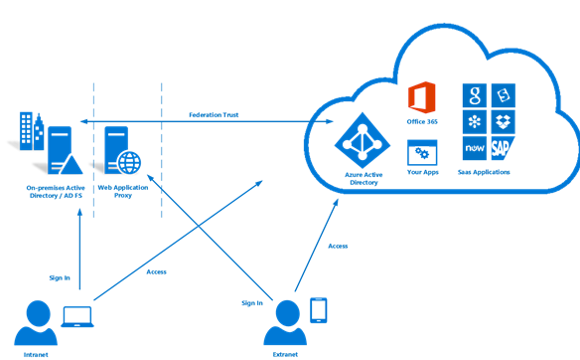
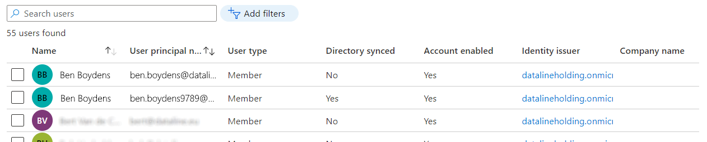
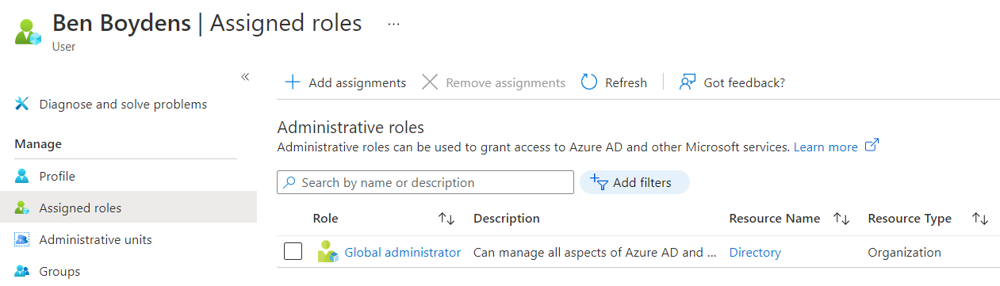

# Microsoft Azure

Dataline zelf heeft al een Office 365. Dat is een online cloud omgeving die allerlei services zal aanbieden. Het word gebruikt om bijvoorbeeld Office Lisencies voor word, excel en powerpoint toe te kennen aan gebruikers. Deze gebruikers worden opgeslagen in een Azure AD.

Met de huidige implemtatie hebben gebruikers dan 2 accounts:
- **Een Office 365 account in de cloud**
- **Een on premise Active Directory account**

De 2 accounts hebben aparte wachtwoorden. Dit kan ambetant zijn voor gebruikers. Ook om de huidige omgeving te brengen naar de cloud moeten deze accounts gesynchroniseerd worden. Als de accounts gesynchroniseerd zijn dan kunnen we de accounts in Azure AD gaan gebruiken om de gebruikers te auhenticeren in de cloud. We kunnen dan deze accounts gebruiken met andere applicaties die werken in de cloud.

We zullen een plan moeten bedenken om de accounts te gaan synchroniseren. Kijken wat onze opties zijn en kijken welke we zullen gaan implementeren.

## Azure AD synchronisatie

Microsoft geeft ons een heleboel mogelijkheden om dit probleem aan te pakken. Hier zullen we de stappen overlopen om tot de juiste conclusie te komen.

### Bepalen van Hybrid Identity

Authenticatie in cloud is zeer belangrijk om te weten wie de applicatie gebruikt. Microsoft Er zijn 3 manieren om gebruikers te authenticeren in de cloud.

- Password hash sync
- Pass-through authentication
- Federation

#### Password hash synchronization

De hash waarde van het wachtwoord in Active Directory zal gesynchroniseerd worden met een hash die word opgeslagen in de cloud. Zo kunnen gebruikers inloggen in de cloud met hetzelfde wachtwoord. Dit is de standaard methode om authenticatie te gaan doen en het is ook de gemakkelijkste manier.

Password hash sync heeft ook een optie **Leaked credential detection**. Microsoft werkt samen met dark web onderzoekers en law enforcement agencies om gelekte credentials te vinden. Als Microsoft merkt dat er wachtwoorden van jouw organisatie tussen zitten dan wordt je daarvan op de hoogte gebracht.

#### Pass-through authentication

Met Pass-through authentication gebeurt de authenticatie niet meer in de cloud maar on premise. Wanneer een gebruiker probeert in te loggen via de cloud wordt er een verbinding gemaakt met de Active Directory die lokaal op het kantoor staat.

Een voordeel hiervan t.o.v. password hash sync is dat alle authenticatie nu gebeurt op de lokale domain controller. Dit zorgt dat lokale security en password policies toegepast kunnen worden zelf als de gebruiker inlogt via de cloud. 

#### Federation

Gebruikt een aparte vertrouwde server om de authenticatie te gaan doen. Mensen die van buiten af toegang willen tot de cloud moeten zich eerst authenticeren bij die server. Mensen die lokaal proberen in te loggen kunnen gewoon gebruik maken van de on premise active directory.

Het grote voordeel van Federation is dat er enorm veel vrijheid is om de authenticatie te gaan doen. De andere 2 methoden zijn standaard methoden van microsoft die beperkte functionaliteit hebben. Zo kun je bijvoorbeeld met federation smartcard authenticatie implementeren.

## Hybrid Identity Keuze

We kunnen onderstaande flowchart gebruiken die op de officiële Microsoft Docs staat. Deze kan ons helpen om een keuze te gaan maken.

Microsoft geeft ons 5 mogelijke oplossingen om mee te werken. 

- Password Hash Sync
- Pass-through Auth 
- Pass-through Auth + Password Hash Sync
- Federation
- Federation + Password Hash Sync

Password hash Sync kan gecombineerd worden met de andere authenticatie methoden. Zo kunnen we **Leaked Credentials Detection** van password hash sync combineren met Pass-through authentication en Federation. 
Dit heeft nog een ander voordeel en dat is dat we Password hash sync kunnen gebruiken als backup methode voor moest er iets mislopen. Dit wordt ook **Sign in disaster recovery** genoemd en je kunt het zien in de flowchart.

#### Keuze

Federation zal zeker geen optie zijn voor Dataline. Het is lastig om op te zetten en is overbodig. De andere methoden passen beter en zijn gemakkelijker. De Leaked credentials report zou een feature zijn die van pas zou kunnen komen. Daarom dat we zeker Password Hash Sync moeten hebben.

Dat geeft ons nog 2 keuzes:

- **Password Hash Sync**
- **Pass-through Auth + Password Hash Sync**

Pass-through Auth + Password Hash Sync zo ideaal zijn maar het laat ons niet toe om de Cloud Sync Agent te gebruiken. Dit is iets wat later nog aan bod komt maar daarom gaat onze keuze naar **Password Hash Sync**.

## User en group provisioning

Provisioning is het process die automatisch gebruikers gaat aanmaken, verwijderen en up to date houden. Wij willen onze Active Directory synchroniseren met Azure AD. 

Er zijn 3 opties waar tussen we kunnen kiezen om dit te gaan doen:

| Optie  | Beschrijving |
| :---: | :--- |
| **Microsoft Identity manager** | Oorspronkelijk niet gemaakt voor hybrid AD management, beperkte functionaliteit, **NIET** aanbevolen |
| **Azure AD connect sync**  | Veel support en is robust, zeker een optie. Kan moeilijk zijn om te configureren en kostelijk om te onderhouden. Heeft ook een grote investering nodig op vlak van infrastructuur (sterke server nodig voor synchronisatie). |
| **Azure AD connect cloud sync** | Nieuwste optie support niet alle senarios maar de meeste, zeer snel en makkelijk op te zetten. Hoge availability.  Is lightweight dus geen nood aan een sterke server voor de synchronisatie. |

### Verschillen

De Identity manager zullen we zeker niet gebruiken. Dan ligt de keuze nog tussen de **Connect Sync** en **Connect Cloud Sync**. Hier zetten we enkele voor- en nadelen op een rij van beide.

| Feature                                       | Connect Sync | Cloud Sync |
| :-------------------------------------------: | :----: | :----: |
| Pass-through authentication (PTA) Support     |   ✔️   |   ❌   |
| Synchronize customer defined AD attributes    |   ✔️   |   ❌   |
| Support for password writeback                |   ✔️   |   ✔️   |
| Support for device or group writeback         |   ✔️   |   ❌   |
| Exchange hybrid writeback                     |   ✔️   |   ❌   |
| Azure AD Domain Services support              |   ✔️   |   ❌   |
| Multiple active agents for high availability  |   ❌   |   ✔️   |
| Lightweight agent installation model          |   ❌   |   ✔️   |

Er is niet echt een goede server om de Connect Sync server te runnen en extra features die we krijgen bij Connect Sync niet echt nodig zijn. De belangrijkste feature was password writeback en deze word ondersteunt door beide. Daarom gaat de voorkeur naar de Cloud Sync methode.

Een volledige lijst met alle verschillen tussen de 2 kun je vinden in de Microsoft Docs [hier](https://docs.microsoft.com/en-us/azure/active-directory/cloud-sync/what-is-cloud-sync#comparison-between-azure-ad-connect-and-cloud-sync)

## Soft- en Hardmatch

Een aantal werknemers van Dataline hebben nu 2 accounts:

- Een Office 365 account (opgeslagen in Azure AD)
- Een on premise Active Directory account

Deze accounts zullen gesynchroniseerd moeten worden met elkaar. Maar hoe weet de synchronisatie agent welke accounts overeen komen met elkaar? Dit gebeurt aan de hand van een **Soft- of Hardmatch**.

De Office 365 accounts zijn belangrijk omdat die gebruikt worden om licenties aan gebruikers toe te kennen (bv Word). Als er iets misloopt bij het matchen van de 2 accounts zal er een nieuw account aangemaakt worden. Dat zorgt ervoor dat de licentie niet zal toegekend zijn voor die persoon.

### Softmatch

Bij een soft match gaat er gekeken worden naar 2 attributen van een gebruiker. 

- **proxyAddresses**
- **userPrincipalName** 

Het attribuut **proxyAddresses** bestaat uit meerdere delen. Hier zal er enkel naar het SMTP gedeelde gekeken worden wat neer komt op de email van de gebruiker.

De **userPrincipalName** komt neer de systeem representatie van een gebruiker in een email formaat. Meestal komt dit overeen met het email address van de gebruiker maar niet altijd!

### Hardmatch

Bij een hard match gaat er gekeken worden naar een enkel attribuut. Namelijk **sourceAnchor/immutableID**. Dit is een soort identifier die uniek is voor elke gebruiker.

### Idfix

Om zeker te zijn dat er geen problemen zouden voorkomen bij het synchroniseren raad Microsoft aan om de idFix tool te gebruiken.  Het zal mogelijke problemen gaan opsporen die kunnen optreden bij synchronisatie naar de cloud. Het checkt voor duplicates, missing attributes, en rule violations.

## Uitvoering

Dan wordt het tijd om de cloud sync agent te gaan installeren op de nieuwe domain controller. Dit gebeurt gewoon via een installer die je kan downloaden van de Azure AD web interface. Er wordt gecontroleerd voor problemen met de gebruikeraccounts met de idFix tool. De tool vindt geen problemen, dus kan de synchronisatie starten.

### Problemen Softmatch

Voor dat we de synchronisatie starten laat de web interface van Azure AD ons toe om eerst een enkele gebruiker te syncen als test. We proberen eens een enkele gebruiker te synchroniseren maar er loopt iets mis! We zien dat er een nieuwe gebruiker wordt aangemaakt en dat de oude gebruiker blijft bestaan zonder dat die gesynchroniseerd is.

De reden dat hier is misloopt is omdat het gebruiker account een admin role heeft toegekend.

Microsoft zegt zelf:

> Azure AD Connect isn't allowed to soft match a user object from on-premises AD with a user object in Azure AD that has an administrative role assigned to it. [Link](https://docs.microsoft.com/en-us/azure/active-directory/hybrid/tshoot-connect-sync-errors#existing-admin-role-conflict)

Dit wordt gedaan voor de veiligheid omdat het matching van gebruikers automatisch gebeurt en je dus geen controle hebt over wie het zal matchen. Je wilt zeker niet per ongeluk een admin role gaan toekennen aan een gebruiker die het niet nodig heeft. Dus voor veiligheids redenen laten ze het niet toe.

Dit is snel opgelost omdat we gewoon die role kunnen weg doen van elke gebruiker. Na dit te doen werkte de synchronisatie zoals verwacht.