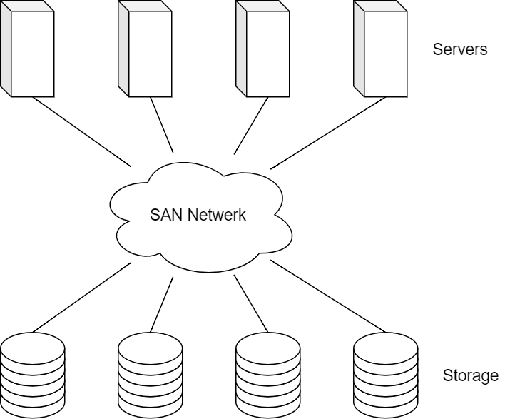
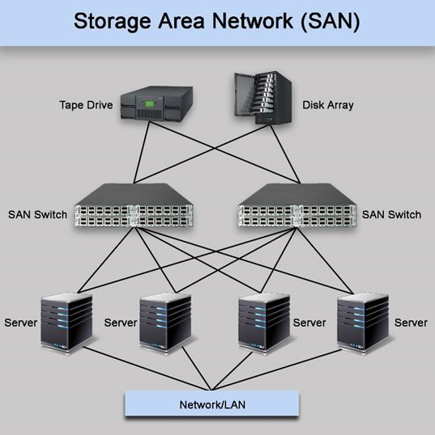
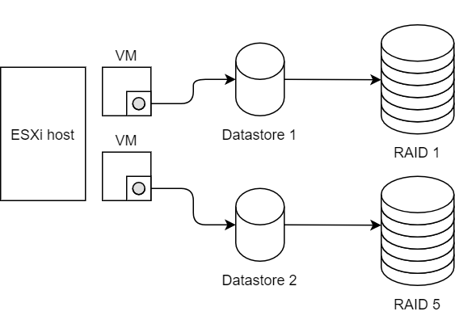
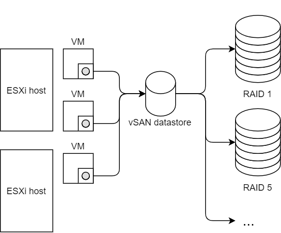
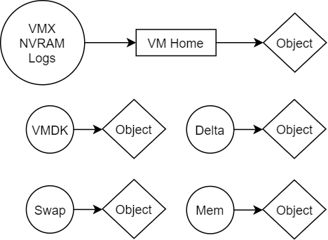
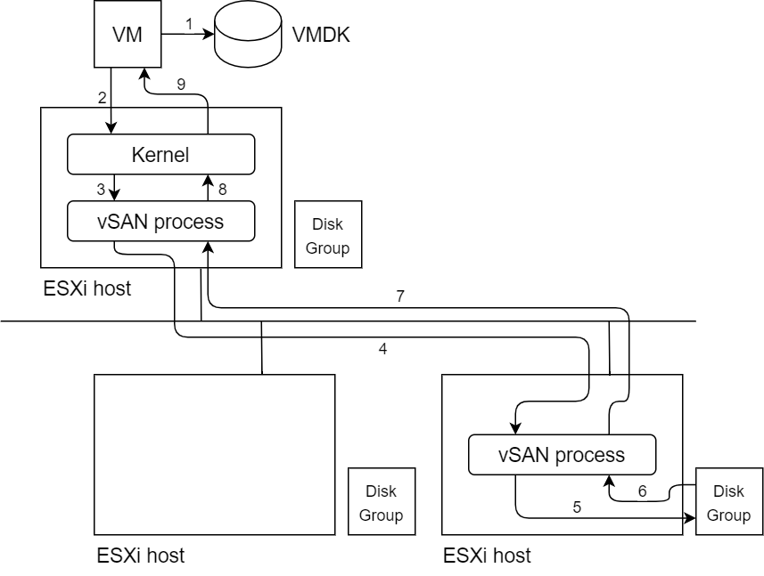
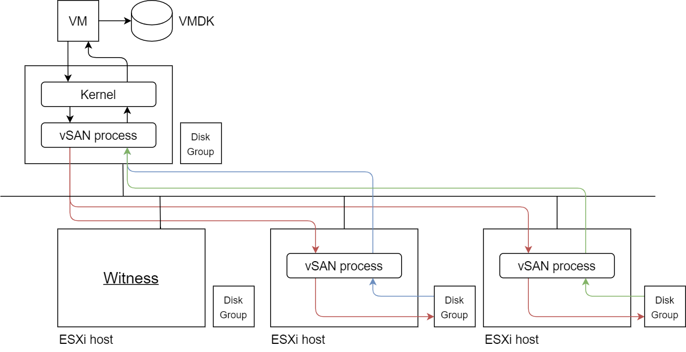

# SAN vs vSAN

Om de telefonie servers van Dataline fout tolerant te maken moet er een oplossing zijn die automatisch of zeer makkelijk virtuele machines kan beveiligen. Een SAN of vSAN wordt door veel bedrijven gebruikt om hun storage fout tolerant te gaan maken. In dit hoofdstuk worden beide oplossingen vergeleken en wordt de werking ervan uitgelegd.

## SAN

Een Storage Area Network (SAN) is een netwerk dat specifiek gebruikt wordt om grote hoeveelheden data te gaan opslaan. Een SAN bestaat uit 3 grote delen. De **servers**, het **netwerk** en de **storage**. De servers zijn allemaal verbonden via het netwerk. Het netwerk zelf bestaat uit een aantal switches die allemaal verbonden zijn met hoge snelheid verbindingen, dit zodat de data zo snel mogelijk kan doorgegeven worden naar de servers. De storage zal de data meerdere malen gaan opslaan voor redundancy.

### SAN Netwerk

Het SAN netwerk uit hoge snelheid verbindingen en switches die worden verbonden met alles in het netwerk. Dit zorgt ervoor dat er voor elke verbinding een vervanging is, zo kan gelijk welke verbinding in de figuur verwijdert worden en alles zal nog bereikbaar zijn. SAN is enorm schaalbaar want er kan zoveel storage en servers gebruikt worden als nodig is. Deze kunnen makkelijk achteraf nog toegevoegd worden.

### SAN Fiber

Een SAN maakt storage devices beschikbaar voor de servers over het netwerk. Er worden speciale protocollen gebruikt om IO operaties over een netwerk te sturen. Een SAN maakt altijd gebruik van Block storage, dit wil zeggen dat data geschreven en gelezen wordt in blokken. Er zijn 2 frequente protocollen die gebruikt worden voor een SAN.

| Protocol | Beschrijving |
| :---: | :--- |
| Fibre Channel Protocol (FCP) | Dit protocol is de snelste optie en geeft verbindingen van 2 GBit/s tot 128 GBit/s. Werkt enkel op fiber verbindingen. Special netwerk kaarten zijn nodig om dit te ondersteunen. |
| Internet Small Computer System Interface (iSCSI) | Dit is een goedkoper alternatief dan FCP. Maar het is ook trager. Werkt op gewone ethernet verbindingen. |

### SAN Use Cases

Om beter te begrijpen waarom een SAN nodig zou zijn, worden hier enkele use cases overlopen van een SAN.

| Use Case | Uitleg |
| :--- | :--- |
| Oracle databases | Worden veel gebruikt en hebben hoge performance + availability nodig |
| Microsoft SQL Server databases | Bevatten vaak kritische data dus hoge performance + availability nodig |
| Large virtualization deployments using VMware, KVM, or Microsoft Hyper-V | Meestal bevatten deze omgevingen vele verschillende virtuele machines. Vele verschillende besturingssystemen en applicaties draaien op deze virtuele servers. Daarom dat het belangrijk is dat de infrastructuur betrouwbaar is en fout tolerant. Want een enkele failure kan meerdere applicaties beïnvloeden. |
| Large virtual desktop infrastructures (VDIs) | Vele virtuele desktops kunnen lastig zijn om te beheren. Een SAN zorgt dat alle data gecentraliseerd is en makkelijker te beheren. |

### Voordelen

- SAN's zijn fout tolerant en verwijderen de single point of failure. Zelf als er een server, een switch of een storage unit zou weg vallen zijn er nog andere apparaten in het netwerk die de taak kunnen overnemen.
- Deze manier is ook enorm schaalbaar omdat er gemakkelijk meer storage en servers kunnen toegevoegd worden.

### Nadelen

- Een fysieke SAN aanmaken kan enorm duur zijn.
- Het is complex om te realiseren

## VSAN

Een vSAN is een alternatief voor een gewone SAN. Het is een virtuele versie van een SAN. Een vSAN abstraheert de opslag en zorgt dat applicaties en virtuele machines toegang hebben tot een virtuele datastore. Het combineert de storage van verschillende virtuele servers tot **1 algemene datastore**.

Een vSAN is dus een soort **virtueel netwerk** die gebruikt wordt om de storage af te handelen. Het voordeel hiervan is dat de storage door software zal worden beheert en dat er meer vrijheid en opties zijn. Zo kan data bijvoorbeeld geabstraheerd  en verdeeld worden over verschillende harde schijven. Zo kan fout tolerantie gerealiseerd worden met RAID 1, 5 of 6.

Soms wil een bedrijf verschillende data anders gaan behandelen. Bijvoorbeeld als er 2 virtuele machines zijn. Stel op VM1 is er simpele RAID 1 bescherming, terwijl de data op VM2 RAID 5 bescherming nodig heeft. Op de traditionele manier kan niet met 1 datastore gewerkt worden en zouden er 2 nodig zijn aangezien ze verschillende RAID methoden gebruiken.

Maar met vSAN kan de storage worden geabstraheerd zodat er een enkele centrale datastore is. In die datastore wordt er dan gezorgd dat de RAID 1 en 5 bescherming geïmplementeerd worden. Dit gebeurt automatisch en kan ingesteld worden naar de noden van de gebruiker.

Er zijn een heleboel opties waaruit kan gekozen worden om vSAN te implementeren. Veel gebruikte opties zijn bijvoorbeeld: **VMWare vSAN, Starwind vSAN en Microsoft Storage Spaces Direct**. De voorkeur gaat naar VMWare aangezien deze gemakkelijk te gebruiken is, maar Starwind vSAN werkt ook met ESXi en is goedkoper. Microsoft Storage Spaces Direct (S2D) werkt dan weer met Hyper-V en Windows datacenter dus dit is geen oplossing.

## VMWare vSAN

Alhoewel VMWare enorm duur is, zijn de oplossingen die ze bieden de beste en gemakkelijkste. Zelf nieuwe gebruikers leren zeer snel werken met VMWare ESXi. In tegenstelling tot KVM is VWWare de meest gebruiksvriendelijke oplossing. Daarom wordt hier in detail bekeken hoe VMWare vSAN in elkaar zit.

### Objecten

VMWare vSAN zet files in de datastore als objecten die opgeslagen worden over de verschillende disk groups. Meestal wordt er voor elke file een object gemaakt. Kleine files worden soms ook samen gevoegd tot 1 enkel object. In onderstaande figuur worden de VMX, NVRAM en logs samen gevoegd tot 1 object. VMWare noemt deze files samen het VM Home object. Deze bevat allerlei meta data van de VM.

### Disk Groups

Disk groups (DG) is een verzamel naam voor verschillende harde schijven. Elke ESXi host kan een maximum van **5 disk groups** hebben. Elke disk group bestaat dan weer uit maximum 8 storage devices. Er zal 1 storage device gebruikt worden als cache, de andere 7 kunnen gebruikt worden als **capacity**. De capacity bevat de eigenlijke data en de cache wordt gebruikt om reads en writes te versnellen. Er zijn 2 opstellingen voor disk groups.

#### Hybrid

Bij een hybride oplossing word er gebruikt gemaakt van SSD's en HDD's. Als cache word er een enkele SSD gebruikt, voor capacity worden enkel HDD's gebruikt. De cache wordt 70% gebruikt voor reads en 30% voor writes.

#### All Flash

Bij een all flash oplossing word er enkel gebruikt gemaakt van SSD's. Dezelfde verdeling geld als bij een hybride disk group alleen word de cache nu enkel nog maar gebruikt om te schrijven naar de capacity. De cache wordt dus enkel gebruikt voor writes in een all flash set up.

---

### Data placement

Het is belangrijk om te weten hoe de data wordt verdeeld over verschillende ESXi hosts. Hier worden de verschillende stappen overlopen die gebeuren wanneer er data ingelezen of geschreven wordt

#### Stappen:

1. VM stuurt een write naar de VMDK file
2. Die write word opgevangen door de Kernel
3. De kernel roept dan het vSAN process op om de write af te handelen
4. Het vSAN process weet waar in het netwerk de write naar toe moet en stuurt het naar de juiste ESXi host
5. Het vSAN process van de andere host stuurt de write dan naar de Disk Group van de host zelf en past die toe
6. De disk group reageert met een success of fail acknowledgement
7. Het vSAN process stuurt die acknowledgement door naar de originele host
8. Het process licht de kernel in
9. De VM krijgt de acknowledgement van de kernel wat evenwaardig is als een acknowledgement van de VMDK

Waar precies het vSAN process de reads en writes naar toe stuurt hangt er van af. Het vSAN process zal de blokken data van de VMDK file gaan verspreiden over het netwerk. Het vSAN process onthoudt waar alles bewaard wordt. Zodat wanneer een read of write zich voort doet het process weet naar welke host het moet sturen.

---

### Failures to tolerate

Failures To Tolerate of FTT staat voor het aantal fouten die zich mogen voordoen in een vSAN. Wanneer bijvoorbeeld de FTT gelijk is aan 1 dan wil dat zeggen dat zelf als er 1 fysieke component weg valt de virtuele machine nog steeds toegang heeft tot die component.

Hoe zou de data verspreid worden over het netwerk als er een FTT gelijk aan 1 zou zijn? Een RAID 1 methode zou kunnen gebruikt worden. Dit wil zeggen dat de data 2 maal wordt opgeslagen op verschillende locaties. Dit wordt ook een **2 node setup** genoemd aangezien er op 2 plekken data wordt opgeslagen. Voor een 2 node setup hebben ook nog een derde host nodig die de Witness zal zijn.

#### Witness

Waarom is de witness nodig? Omdat anders kan het zijn dat de 2 hosts niet gesynchroniseerd zijn en de verschillen bij elkaar niet zien. Dan is er een **split brain** situatie. In zo een situatie weet het vSAN process niet meer welke van de 2 hosts nu de correcte data bevat. Daarom moet er een derde host zijn die de verschillen bijhoud van beide om zo de beste beslissing te kunnen maken.

De witness zelf slaat geen data op van de virtuele machine maar zal enkel metadata gaan opslaan. Deze data wordt ook de **Witness Component** genoemd in een vSAN en is ongeveer 4 MB groot.

#### Schema

Op de afbeelding kun worden verschillende hosts voorgesteld om te zien en wat er precies gebeurt als de VM wil schrijven of lezen naar de VMDK file wanneer deze een FTT hebben van 1. Het is gelijkaardig met de afbeelding van data placement maar er zijn nog een paar kleine verschillen.

1. De stappen van de VM tot het vSAN process zijn identiek
2. Het vSAN process stuurt de write of read door naar **alle hosts** die de data bevatten.
3. Elke host stuurt dan een acknowledgement terug naar de host die de VM bevat
4. Pas wanneer elke host terug stuurt zal het vSAN process de acknowledgement doorgeven aan de kernel

## Pricing

Nu één van de belangrijkste aspecten is de prijs van de oplossing. Als er gekeken wordt naar de prijs van VMWare vSAN dan valt het op dat de prijzen enorm hoog zijn. VMWare is een bedrijf die zich meer zal focussen op grotere bedrijven die honderden virtuele machines moeten beheren. VMWare vSAN wordt voorlopig uitgesloten omdat de prijs gewoon veel te hoog voor zo'n klein bedrijf als Dataline.

Starwind vSAN aan de andere kant is meer gericht op kleinere bedrijven die niet te veel willen betalen voor een vSAN oplossing. Daarom zou Starwind vSAN een ideaal alternatief zijn. Maar er moet niet alleen gekeken worden naar prijs, kwaliteit is ook belangrijk. VMWare is een zeer gekende speler op het vlak van vSAN, maar Starwind is minder bekend. Daarom is het belangrijk dat de Starwind vSAN eerst getest wordt op een omgeving om te kijken hoe goed het nu eigenlijk echt werkt.

In volgend hoofdstuk wordt dieper ingegaan op de werking van Starwind vSAN en wordt een test omgeving opgesteld.