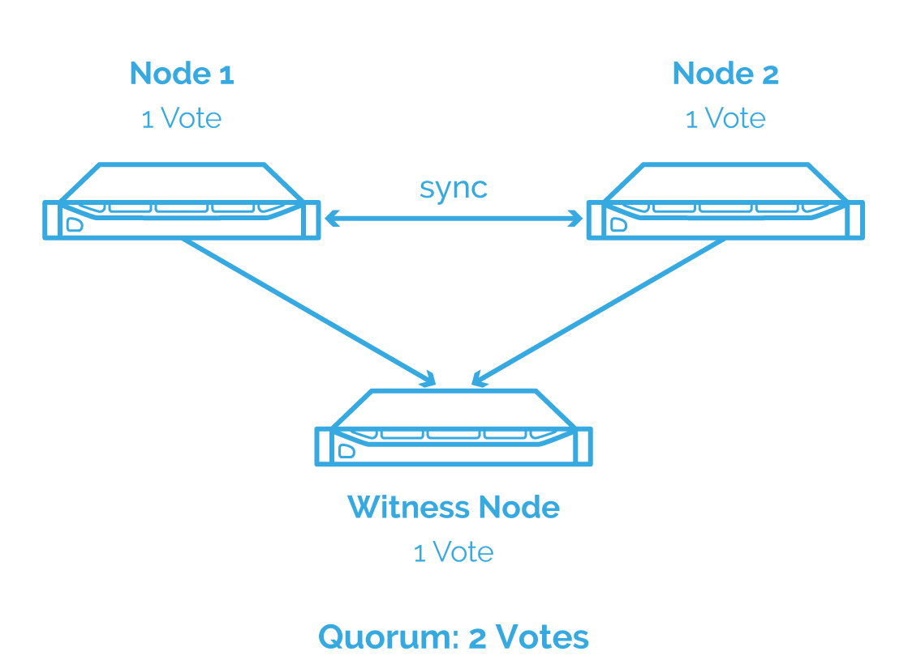

# Test Starwind vSAN

Starwind vSAN is een bekende speler op de markt van Hyper Converged Infrastructure. Hun oplossing voor vSAN zou ideaal zijn voor Dataline aangezien we geen dure VMWare licenties nodig hebben. Maar de vraag is natuurlijk hoe goed is Starwind vSAN. Als we kijken naar de reviews dan zien we dat vele bedrijven tevreden zijn met Starwind vSAN. Om dit zeker te zijn maken we een test opstelling, hier testen we dan de performance en kwaliteit van Starwind vSAN. 

## Opstelling

Als opstelling gebruiken we 2 gebruikte desktop computers die Dataline nog liggen had. Die breiden we dan uit met een gloed nieuwe snelle netwerkkaart met 2 poorten (25 Gbps) en een 350 GB SSD.

Starwind heeft een 30 day free trial waarmee we een 2 node setup kunnen testen. Twee nodes is het absolute minimum dat nodig is om een vSAN te gebruiken. Met een node wordt hier een server bedoeld die de Starwind virtuele machine aan het draaien is. De setup die zal gevolgd worden is de volgende.

In totaal zullen er 3 verbindingen nodig zijn op de nodes:
- iSCSI/Heartbeat
- Synchronisatie
- Management

Het iSCSI/heartbeat en synchronisatie kanaal wordt gebruikt om data en commando's door te geven tussen de hosts. Deze verbindingen gebeuren best met de nieuwe netwerkkaart zodat de data zo snel mogelijk kan gesynchroniseerd worden. Management is bedoeld als aanspreekpunt voor het beheren van de ESXi host en Virtuele machines.

## Failover strategie

Bij het geval dat de verbinding tussen 2 nodes zou weg vallen door een netwerk problemen dan hebben we een zogenaamde netwerk partitie, dit zorgt dat de nodes niet meer kunnen communiceren met elkaar en kan leiden tot een **split brain** scenario. Split brain kan zeer erge gevolgen hebben zoals het verliezen van data en het moet absoluut vermeden worden.

In deze situatie zal elke node naar zijn eigen storage schrijven. Zo ontstaan er data inconsistenties tussen de 2 nodes waardoor ze steeds meer van elkaar gaan verschillen. Uiteindelijk gaan ze zoveel met elkaar verschillen dat de data niet meer gesynchroniseerd kan worden.

Als je dan wilt je data herstellen dan zul je een node moeten kiezen om verder op te werken. Alle wijzigingen van de andere node worden daardoor ongedaan gemaakt. Het risico van een split brain scenario moet daarom zo laag mogelijk zijn. Starwind vSAN geeft ons 2 manieren om zo'n scenario te vermijden. 

### Heartbeat

Er wordt een zogenaamde heartbeat verbinding opgesteld tussen nodes. Wanneer een node merkt dat de synchronisatie verbinding niet meer werkt tussen een partner node dan zal er een ping gestuurd worden via het heartbeat kanaal. Als de partner node antwoord dan zal Starwind de node blokkeren met een lagere prioriteit tot de synchronisatie verbinding terugkomt.
Als de partner node niet antwoord dan gaat Starwind vSAN er vanuit dat die offline is. Starwind vSAN markeert de partner node dan als niet gesynchroniseerd.

Stel bijvoorbeeld dat er 2 nodes zijn zoals in de figuur en de data kan niet verzonden worden via de synchronisatie verbinding. Dan kunnen de 2 nodes niet gaan synchroniseren met elkaar. Via het heartbeat kanaal checkt de primary node de status van de 2 systemen. Het ziet dat beide systemen nog in sync zijn en zal de secundaire node blokkeren zodat het niet meer reageert op requests. De secundaire node check regelmatig de verbinding van het synchronisatie kanaal. Vanaf dat er terug verbinding is, zal het synchronisatie process terug starten en wordt de secundaire node weer actief.

#### Nadeel:

Indien alle verbindingen (heartbeat + synchronisatie) verbroken worden tussen de 2 hosts dan zal er een split brain situatie ontstaan. Starwind vSAN probeert dit probleem te minimaliseren door toe te laten dat de heartbeat verbinding over het management netwerk gaat. Starwind raad deze aanpak enkel aan wanneer er meerdere heartbeat verbindingen zijn.

> To summarize, this kind of strategy is mostly applicable to the systems where you have enough network links that can be used as the additional heartbeat channels and are physically separated from the primary ones. [Starwind](https://www.starwindsoftware.com/blog/whats-split-brain-and-how-to-avoid-it)

### Node majority

Een andere manier om split brain te gaan vermijden is door een **Witness node** te gaan toevoegen. Het is een gekende strategie en wordt ook door VMWare gebruikt. De witness houd informatie bij van beide nodes en wanneer de synchronisatie zou weg vallen dan zal de witness mee beslissen over welke node de primaire node is.

Om te beslissen wie de primaire node wordt zal er een stemming gedaan worden. De node met de meeste stemmen wordt dan de primaire node. Elke node zal voor zichzelf stemmen waardoor en geen meerderheid zal zijn, daarom moet er een derde node om de knoop door te hakken. De witness zelf houd gewoon meta data bij en heeft dus zelf niet veel storage en resources nodig.

Stel we hebben bovenstaande configuratie en de synchronisatie valt weg. Dan zal de witness node die verbonden is met beide nodes, een meerderheid vormen met de node die de meest relevante data heeft (in dit voorbeeld node 1). Daardoor zal node 2 gemarkeerd worden als niet gesynchroniseerd en zal die niet meer luisteren naar requests. Het grootte voordeel van deze aanpak is dat split brain zich niet meer kan voordoen, maar je hebt wel een extra node nodig.

#### Voordelen

- Het split brain scenario is volledig uitgesloten
- Een extra heartbeat verbinding is niet nodig

#### Nadelen

- Bij 2 node setup is een derde witness node nodig
- met 3 nodes mag er maar 1 failure voorkomen

## Synchronisatie test

Om te kijken of de synchronisatie tussen de nodes gebeurt moeten we eens kijken als de wel degelijk gerepliceerd wordt over de nodes. Om dit te doen kunnen we een simpele test uitvoeren.
1. We maken een bestand aan op één node. 
2. We sluiten de vm af
3. We starten een dezelfde VM op de andere node
4. We kijken of dit bestand ook op de andere node zich bevindt

Dit lukt zonder problemen en alles werkt zoals verwacht.

## Performance Test

Storage is de traagste factor van elke computer, daarom is de performance van storage zeer belangrijk voor virtuele machines. Om te kijken of Starwind vSAN een goede optie zou zijn, moeten we weten hoe efficient Starwind omgaat met storage. Een heleboel factoren hebben invloed hebben op de performance van vSAN, dus het is belangrijk om verschillende opstellingen te testen en te kijken wat het beste optie is. 

Hoe kan de performantie getest worden van een vSAN? Een manier om dit te doen is om een werklast te gaan genereren op de storage van een virtuele machine.

Er zijn 3 scenario's die interessant zijn om te testen voor performance:
- VM op lokale datastore
- VM op vSAN datastore
- VM moet werken via iSCSI omdat lokale host niet gesynchroniseerd is.

### Workload

De manier waarop we een workload zullen simuleren is door gebruik te maken van een Disk IO test tool genaamd **fio**. Het is een command line tool die zeer veel parameters heeft om te gaan testen. De gebruikte parameters zijn gebaseerd op een artikel van Oracle over het testen van Block storage [Oracle](https://docs.oracle.com/en-us/iaas/Content/Block/References/samplefiocommandslinux.htm).

Met fio zullen we IO operaties gaan uitvoeren om statistieken te verzamelen zoals:
- Het aantal IOPS  (Input/Output operaties per seconde)
- De bandbreedte van de data stroom (in MB/s of GB/s)
- Hoe snel de storage antwoord op IO requests (latency)

Om de verschillende aspecten van de storage te controleren gaan er 4 soorten testen uitgevoerd worden:
- Random reads
- File random reads/writes
- Random read/writes
- Sequentiële reads

### Baseline

Eerst stellen we een baseline op waarmee we volgende testen mee zullen vergelijken. Als baseline werken we met de lokale datastore en laten we alles op default instellingen van Starwind vSAN. Eens we alle statistieken hebben verzameld en een overzicht hebben over hoe goed de performance is dan schakelen we over naar de vSAN datastore en kijken we wat de verschillen zijn.

## Resultaten